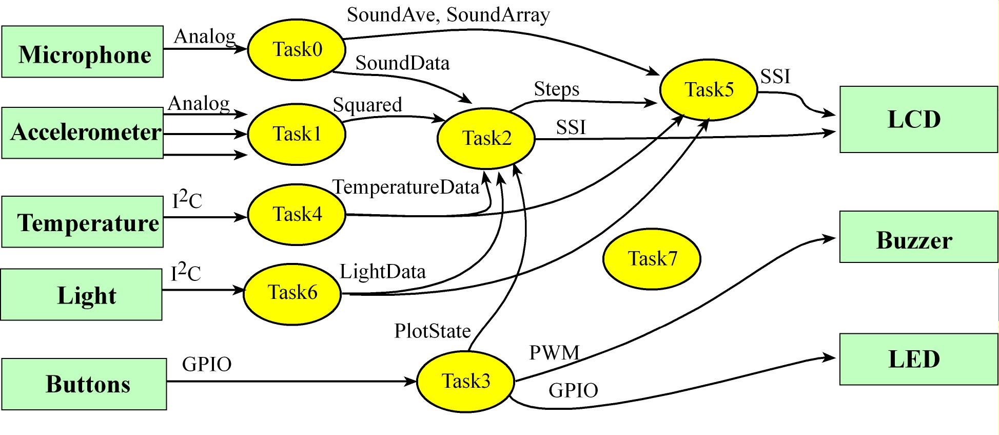
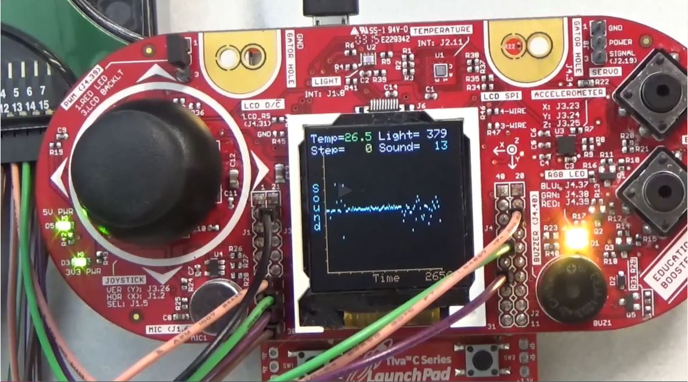

# RTOS_TM4C123

As a project from UTAustinX UT.RTBN.12.01x, I implemented a Real-Time Operating System (RTOS) from scratch for TM4C123xx specifically devised to operate several sensors of a hardware module (BOOSTXL-EDUMKII) concurrently. The features of that RTOS include a priority scheduler, semaphores, thread sleep function, and edge-triggered interrupts to signal semaphores. The user code inputs from the microphone, accelerometer, light sensor, temperature sensor, and switches. It performs some measurements and calculations of steps, sound intensity, light intensity, and temperature. It outputs data to the LCD and generates simple beeping sounds. There are eight tasks in total:

  

- Task0: event thread samples microphone input at 1000 Hz
- Task1: event thread samples acceleration input at 10 Hz (calls Put)
- Task2: main thread detecting steps and plotting at on LCD, runs about 10 Hz (calls Get)
- Task3: event thread inputs from switches, outputs to buzzer (calls Sleep)
- Task4: main thread measures temperature, runs about 1 Hz (calls Sleep)
- Task5: main thread output numerical data to LCD, and runs about 1 Hz
- Task6: main thread measures light, and runs about 1.25 Hz (calls Sleep)
- Task7: the main thread that does do not work

  

